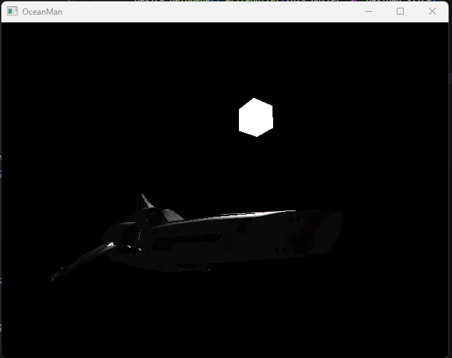

# OceanMan

OceanMan is a real-time renderer focused on making realistic renders. It is developed using [Zig](https://ziglang.org/), [WebGPU](https://www.w3.org/TR/webgpu/), and [Mach](https://machengine.org/). It is currently in version 0.1.

## Installation.

OceanMan was most recently developed using zig 0.11.0-dev.3363+9461ed503.

```bash
git clone https://github.com/tech0tron/oceanman
zig build
```

## Usage

OceanMan requires a m3d file to render. OceanMan should be executed in a working directory where resources/ is located, so it can access shaders.
```bash
oceanman model.m3d
```

## Features

* Phong shading
* Texturing
* Hard-coded light and model positions
* Loading in .m3d files

## Images



## License

[MIT](https://choosealicense.com/licenses/mit/)