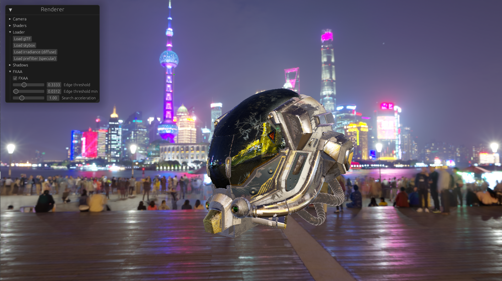
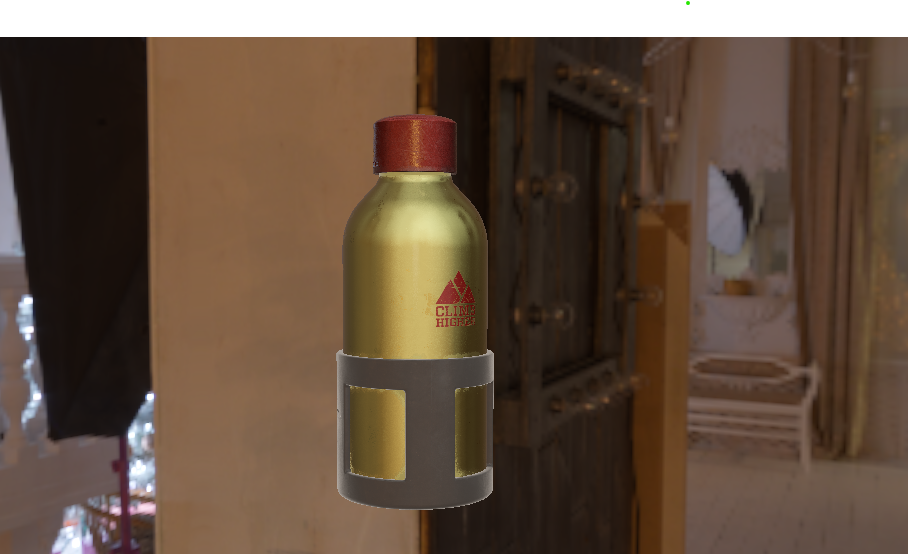

# OceanMan

OceanMan is a real-time renderer focused on realism. It is developed using Rust, WebGPU, and wgpu. It is currently in version 0.3.

## Installation.

OceanMan was most recently developed using rustc 1.70.0 (90c541806 2023-05-31).

```bash
git clone https://github.com/tech0tron/oceanman
cargo build
```

## Usage

OceanMan requires a gltf file to render, as well as environment map, irradiance map, and prefilter map (all in .dds format). 
```bash
oceanman scene.gltf environment.dds irradiance.dds prefilter.dds
```

## Features

* Physically based shading (Cook-Torrance BRDF)
* Image-based lighting
* glTF scene support - loads in color, metal/roughness, and normal maps
* Basic scene camera

## Images



## License

[MIT](https://choosealicense.com/licenses/mit/)